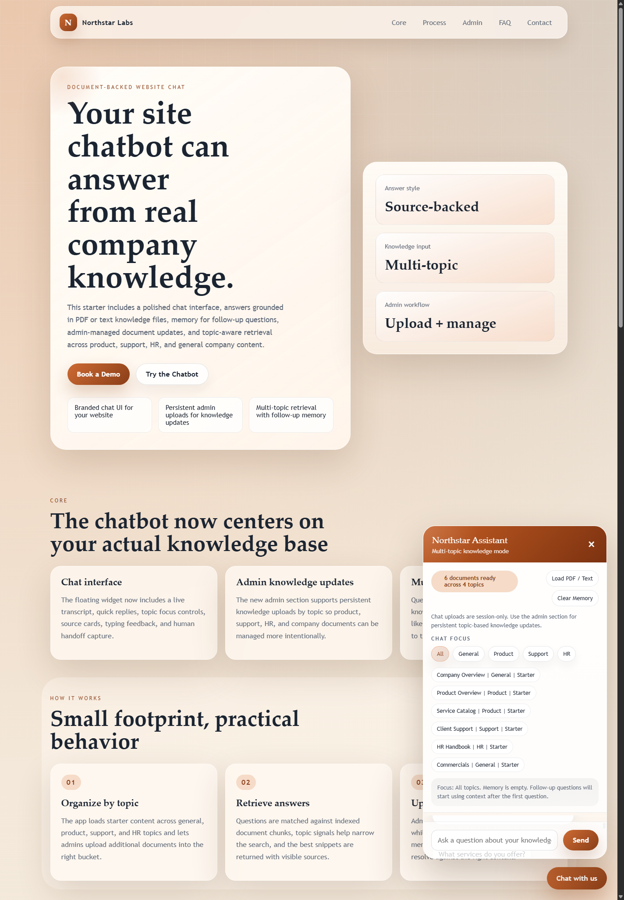
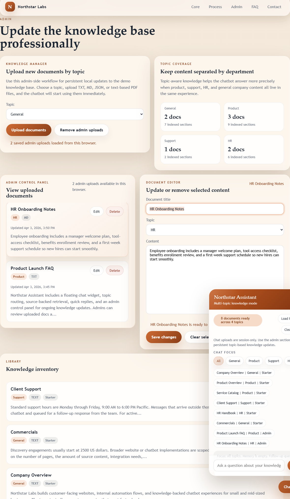

# Northstar Labs Knowledge-Base Chatbot

A polished website chatbot demo with source-backed answers, multi-topic retrieval, stronger follow-up handling, and a professional admin workflow for managing knowledge updates directly in the browser.

## Screenshots

### Homepage and live chatbot



### Admin control panel



## Highlights

- Branded landing page with a floating chatbot experience
- Source-backed retrieval from TXT, MD, JSON, and text-based PDF files
- Topic-aware answers across `General`, `Product`, `Support`, and `HR`
- Better conversation context for longer follow-up flows
- Honest `"I don't know"` fallback with human handoff capture
- Quick replies, typing feedback, loading states, and polished chat spacing
- Admin uploads that persist in browser `localStorage` for this demo
- Admin control panel to view uploaded docs, update content, and delete saved uploads
- Read-only starter document inventory plus session-only chat uploads for testing

## Admin workflow

The admin section now supports three distinct tasks:

1. Upload new knowledge documents by topic.
2. View saved admin uploads in a dedicated control panel.
3. Edit or delete uploaded documents without touching the starter library.

Starter documents remain read-only. Admin uploads are stored locally in the browser for the demo and are available again after refresh in the same browser profile.

## Run locally

### Option 1: Python

```powershell
python -m http.server 3000
```

Then open `http://localhost:3000`.

### Option 2: Node.js

```powershell
node server.js
```

Then open `http://localhost:3000`.

## Knowledge model

Starter knowledge is loaded from [knowledge-base/manifest.json](knowledge-base/manifest.json).

The project ships with topic-tagged documents for:

- General company information
- Product behavior and retrieval workflow
- Support guidance and response expectations
- HR handbook and onboarding content

There are two upload paths:

1. Admin uploads from the page:
   Persistent in browser storage for this demo.
2. Chat uploads from the widget:
   Temporary for the current browser session.

## Project structure

- [index.html](index.html): Landing page, admin section, and chatbot markup
- [styles.css](styles.css): Visual system, layout, and interaction styling
- [app.js](app.js): Chat logic, retrieval, uploads, admin controls, memory, and lead capture
- [server.js](server.js): Minimal local static server
- [knowledge-base/](knowledge-base): Starter knowledge documents and manifest
- [screenshots/](screenshots): README screenshots

## Demo behavior

- Questions are matched against indexed knowledge chunks in the browser.
- Topic focus can be set manually in chat or inferred automatically from the question.
- Follow-up questions reuse more recent conversation context to stay on-topic.
- If the assistant cannot find a reliable answer, it responds clearly instead of guessing.
- Repeated unresolved questions can open the human follow-up form.

## Notes

- PDF parsing is browser-based and works best for text-based PDFs.
- Admin uploads and lead capture are stored locally in the browser for the demo.
- For production, connect uploads, chat memory, and lead handling to your backend or CRM.
